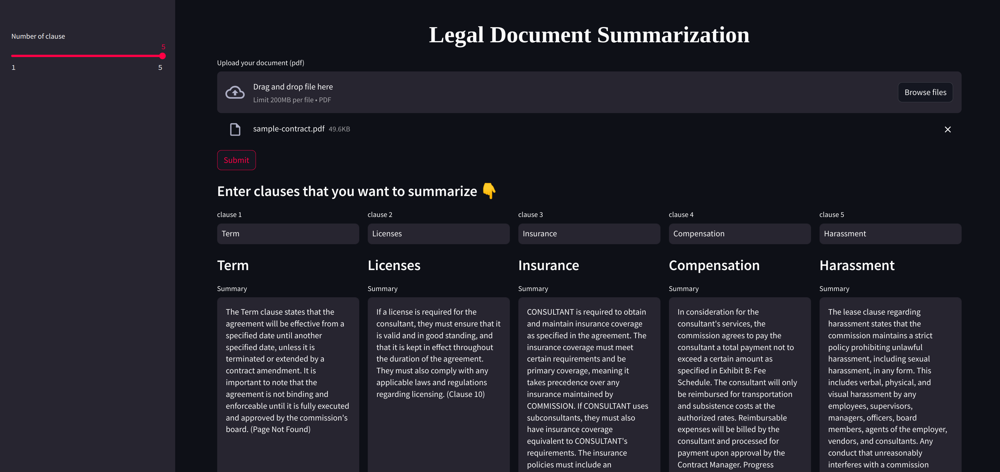

# Legal Summarizer 

 

 


Leveraging LLM to summarize clauses from legal documents.




## Getting started

Create a virtual-env and install the necessary requirements
```bash
$ python -m venn venv
$ venv\Scripts\activate # windows
$ source venv/bin/activate # linux
```

```bash
$ pip install -r requirements.txt 
```

Start the application

```bash 
$ streamlit run application.py
```

